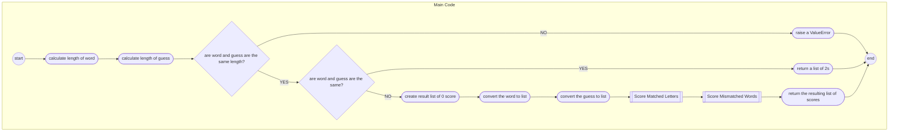
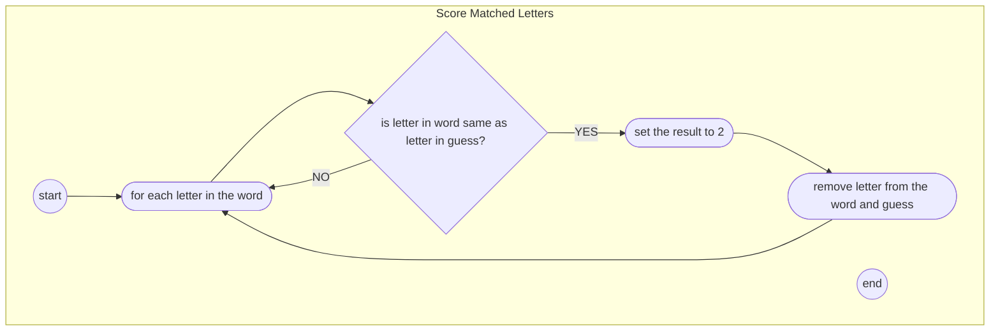
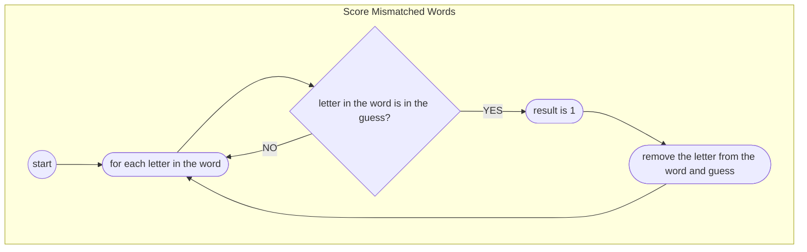

# Wordle Scoring Algorithm

This algorithm uses a two pass solution to complete the
scoring.

## The Basic Algorithm

The basic process used to score is:

- do words differ in length? yes - raise an exception
- are words the same? yes - return [2,2,2,2,2]
- presume all letters are wrong, score 0 for each letter
- locate letters in correct place and score 2 for each correct letter
- locate letters in incorrect place and score 1 for each letter
- return the score

# The Algorithm (Pseudocode)

- get the length of the word
- get the length of the guess
- check if the word and guess are the same length
- if they are not, raise a ValueError
    - if the word and guess are the same,
    - return a list of 2s
- initialise the result list to scores of 0
- convert the word and guess to lists
- check for exact matches
- for each letter in the word
    - check if the letter in the word is the same as the letter in the guess and if it is, set
      the result to 2
    - and remove the letter from the word and guess
- check for partial matches
    - check if the letter in the word is in the guess
        - if it is, check if it is in the guess
            - if it is, set the result to 1
            - and remove the letter from the word and guess
            - end the for loop early
- return the resulting list of scores

## The Algorithm (Flowchart)

